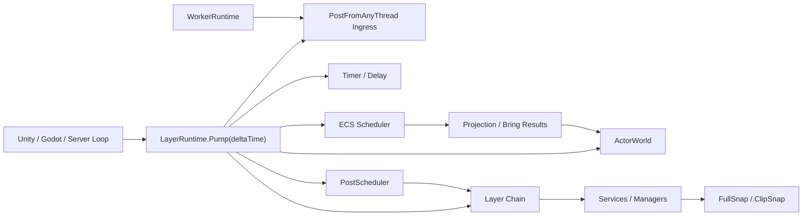

# LayerBase

> LayerBase 是一个面向 Unity、Godot 与纯 C# 服务端的游戏业务运行时框架，用 Layer-Service-Manager、事件系统、Timer、Actor、ECS、Worker 与 Runtime Pump 组织高频、可预测、低分配的游戏逻辑。

## What is this?

LayerBase 不是游戏引擎，而是游戏业务层的运行时骨架。它把常见的 Manager 网状引用、随处订阅事件、异步回调散落、实体行为混杂等问题，收束到一个可驱动、可测试、可预热的 Runtime 模型里。

它适合：

- Unity / Godot 项目中需要独立于引擎生命周期组织业务逻辑的团队。
- 纯 C# 游戏服务器、战斗服、房间服、仿真服务。
- 高频事件、帧驱动调度、Actor 行为封装、ECS 批处理同时存在的中大型项目。
- 想把游戏逻辑从“单例互调”升级到“明确拓扑 + 消息流 + 显式生命周期”的项目。

## Why?

游戏项目规模上来后，常见问题通常不是“没有事件总线”，而是：

- 注册时序不可控：`Awake`、`Start`、构造函数里到处订阅，谁先响应变成隐式事实。
- 模块耦合失控：Manager 互相引用，重构和测试成本持续上升。
- 高频路径不稳定：委托链、字典查找、临时分配、跨线程回调让性能和抖动难以预测。
- 数据与行为混在一起：批量数据处理适合 ECS，独立对象行为适合 Actor，但两者常常缺少明确桥接。

LayerBase 的核心选择是：用 Runtime Pump 驱动一切，用 Layer 拓扑定义顺序，用 Service/Manager 承载业务，用事件、Call、Timer、Actor、ECS 和 Worker 做明确协作。

## Features

| Feature | Description |
| --- | --- |
| Layer Runtime | 独立 `LayerRuntime` 实例，包含 Layer 链、事件中心、PostScheduler、Timer、Delay、ActorWorld、ECS World、WorkerRuntime 与服务容器。 |
| Layer-Service-Manager | 用 Layer 表达宏观顺序和边界，用 Service 聚合业务能力，用 Manager 承载具体逻辑块。 |
| Synchronous Event Flow | `Send<T>` / `[SubscribeFlow]` 支持按 Layer 顺序同步分发，并可通过 `EventHandledState` 截断流转。 |
| Post Scheduler | `Post<T>` / `TryPost<T>` 进入帧调度队列，支持波次隔离、每帧数量预算、时间预算、背压策略。 |
| Event Policies | 支持 Normal、Latest、Coalesced 等投递语义，以及 RejectNew、DropOldest、DropNewest 等背压策略。 |
| PostFromAnyThread | 后台线程可安全提交事件到 ingress queue，由 owner thread 在下一次 `Pump` 中搬运和分发。 |
| Call / Request-Response | `[Call]`、`ILayerCallHandler<TRequest,TResponse>` 与 `CallAsync` 提供低分配请求响应路径。 |
| Timer / Delay | `TimeScheduler`、`DelayPublisher` 与 `this.Delay(...)` 支持 Tick 驱动的一次性和重复定时事件。 |
| Actor Runtime | `ActorWorld` 管理 Actor 创建、销毁、邮箱投递、生命周期、查询、对象池、Actor Call 与事件流。 |
| ECS Runtime | 提供 World、Entity、Component、Query、Blueprint、Projection 与 Bring 流，适合批量数据处理。 |
| Async ECS | 默认同步执行，也可通过 `SetEcsExecutionMode(EcsExecutionMode.Async)` 将 ECS 查询提交到异步调度器。 |
| ECS to Actor Projection | ECS Query 可通过 `Bring<TEvent>()...Batch().Post()` 生成 Actor 事件，并在主线程 Pump 阶段投递。 |
| WorkerRuntime | 后台 `IWorkerEventJob<TInput,TEvent>` 执行纯计算任务，完成后把结果事件交回 Runtime Pump。 |
| Snap | `IFullSnap`、`IClipSnap<T>`、`SnapWriter`、`SnapReader`、数组读写器支持显式业务状态快照。 |
| Source Generator | 用生成器绑定订阅、Call、Actor 行为、FullSnap 节点、Query Bring 等热路径元数据。 |
| Prewarm / Diagnostics | 支持预热、事件图检查、循环风险诊断、运行时警告与测试辅助入口。 |

## Quick Start

安装 NuGet 包：

```bash
dotnet add package LayerBase --version 1.5.7
```

源码引用时，请同时引用核心库、任务库与源生成器：

```xml
<ItemGroup>
  <ProjectReference Include="LayerBase\LayerBase.csproj" />
  <ProjectReference Include="LayerBase.Task\LayerBase.Task.csproj" />
  <ProjectReference Include="LayerBase.Generator\LayerBase.Generator\LayerBase.Generator.csproj"
                    OutputItemType="Analyzer"
                    ReferenceOutputAssembly="false" />
</ItemGroup>
```

最小事件流示例：

```csharp
using LayerBase;
using LayerBase.Core.Event;
using LayerBase.Layers;

public readonly struct PlayerSpawned
{
    public PlayerSpawned(string name, int level)
    {
        Name = name;
        Level = level;
    }

    public string Name { get; }
    public int Level { get; }
}

public partial class GameplayLayer : Layer
{
    [SubscribeFlow]
    private EventHandledState OnPlayerSpawned(in PlayerSpawned value)
    {
        Console.WriteLine($"{value.Name} spawned at level {value.Level}");

        // Continue 表示事件继续流向后续 Layer。
        // Handled 表示当前 Layer 已处理完毕，后续 Layer 不再接收。
        return EventHandledState.Continue;
    }
}

LayerHub.Reset();

LayerRuntime runtime = LayerHub.CreateLayers()
                               .Push(new GameplayLayer())
                               .Build();

runtime.Send(new PlayerSpawned("Hero", 1));
```

帧驱动异步 Post 示例：

```csharp
runtime.Post(new PlayerSpawned("Hero", 2));

// Post 不会立即分发。业务主循环中调用 Pump 后才会处理队列。
runtime.Pump(0.016f);
```

跨线程提交示例：

```csharp
new Thread(() =>
{
    // 仅提交到跨线程入口队列，不在后台线程执行 handler。
    runtime.PostFromAnyThread(new PlayerSpawned("WorkerResult", 3));
}).Start();

// owner thread 在下一帧 Pump 中搬运并派发。
runtime.Pump(0.016f);
```

## Core Concepts

```text
LayerRuntime
 ├── Layer Chain
 │    ├── Layer
 │    ├── Service
 │    └── Manager / Context
 ├── Event System
 │    ├── Send: immediate ordered flow
 │    ├── Post: frame-scheduled queue
 │    └── PostFromAnyThread: cross-thread ingress
 ├── Timer / Delay
 ├── ActorWorld
 │    ├── Mailbox
 │    ├── Lifecycle
 │    ├── Query
 │    └── Pool / Call / EventStream
 ├── ECS World
 │    ├── Entity / Component / Query
 │    ├── Blueprint
 │    └── Projection / Bring
 ├── WorkerRuntime
 └── FullSnap Runtime
```

### LayerRuntime

`LayerRuntime` 是一切运行时资源的拥有者。它负责构建 Layer 链、安装服务容器、启动 ECS Scheduler 与 Worker、驱动 Pump、释放资源。

它不负责替代引擎主循环。Unity、Godot 或服务端进程仍然负责决定何时调用 `runtime.Pump(deltaTime)`。

### Layer

Layer 是宏观顺序和架构边界。一个 Runtime 最多支持 64 个物理 Layer，这是为了使用位图做高频路由。Layer 适合表达 `Input`、`Battle`、`View`、`Network`、`Persistence` 这类大边界。

Layer 不应该变成万能对象。具体业务应下沉到 Service / Manager。

### Service / Manager

Service 聚合某个业务域的能力，并通过 DI 挂载 Manager 或其他依赖。Manager 是更小的逻辑块，适合承载伤害计算、背包状态、同步状态、AI 片段等单一职责。

Service / Manager 之间优先通过事件、Call 或显式服务接口协作，避免恢复成 Manager 网状互调。

### Event System

事件系统分成同步和帧调度两条路径：

- `Send<T>`：立即沿 Layer 顺序同步流转，适合确定性流程。
- `Post<T>`：进入 `PostScheduler`，在 `Pump` 中处理，适合跨阶段、延迟到帧边界的消息。
- `PostFromAnyThread<T>`：后台线程入口，只负责入队，handler 仍在 owner thread 执行。

普通 Runtime API 是 owner-thread only。为了热路径性能，LayerBase 不在每次调用时做线程检查。

### Actor

Actor 封装独立行为对象。它有自己的 ActorId、邮箱、生命周期、行为处理器，可被查询、池化、延迟投递，也可与 ECS 实体投影绑定。

Actor 适合角色、NPC、子弹、技能实例、临时交互对象等行为明确的对象。大规模连续数据处理仍应交给 ECS。

### ECS

ECS World 管理 Entity / Component / Query。它适合大批量、数据密集、缓存友好的系统，例如移动、AOI、碰撞候选、状态批处理。

当前仓库保留 Arch 生态依赖，同时包含 LayerBase 自己的 ECS Runtime、Blueprint、Projection、Query Flow 与 Async Scheduler。

### WorkerRuntime

`WorkerRuntime` 用于把纯计算任务放到后台线程执行。任务实现 `IWorkerEventJob<TInput,TEvent>`，返回的结果事件会进入 Runtime 的 Post 路径，并在 Pump 阶段回到主线程业务流。

它不适合在后台线程直接访问 Layer、Actor、ECS World 或引擎对象。

### Snap

Snap 是显式业务快照，不是 Runtime 内存镜像。

- `IFullSnap`：由 Runtime 构建后收集，参与完整业务快照。
- `IClipSnap<T>`：由业务主动调用的局部切片快照。
- `SnapArrayWriter` / `SnapArrayReader`：适合背包、实体列表等数组型状态。

默认不进入 FullSnap 的对象包括 `EcsWorld`、`ActorWorld`、Actor 邮箱、Timer、Delay 内部队列、渲染对象、线程对象和 `Task`。

## Architecture



典型调用流：

1. 引擎或服务端主循环调用 `runtime.Pump(deltaTime)`。
2. Runtime 先搬运跨线程 ingress 与 Worker 结果。
3. Timer / Delay 到期事件进入 Post 路径。
4. PostScheduler 按预算和策略处理本帧事件。
5. Layer 链执行生命周期更新。
6. ECS Scheduler flush / drain 异步结果。
7. ActorWorld 按预算处理邮箱、生命周期和固定步长更新。

主要扩展点：

- 新 Layer：继承 `Layer` 并放入 `CreateLayers().Push(...)`。
- 新服务：实现 `IService`，通过 `[Mount]` 或 `RegisterService` 挂载。
- 新事件：定义 `struct` 事件，使用 `[Subscribe]`、`[SubscribeFlow]`、`[SubscribeDelay]`、`[ActorBehaviour]` 等绑定。
- 新 Call：使用 `[Call]` 或实现 `ILayerCallHandler<TRequest,TResponse>`。
- 新 Actor：实现 `IActor`，用 `[ActorBehaviour]`、生命周期接口与对象池接口扩展行为。
- 新 ECS 流：定义组件和 Query Job，按需使用 `Bring<TEvent>()` 投影到 Actor。
- 新快照：实现 `IFullSnap` 或 `IClipSnap<T>`，显式写入业务字段。

## Performance

性能数据必须按测试条件理解，不应把局部 benchmark 当成完整游戏帧表现。

当前仓库的 benchmark 文档位于 `docs/BENCHMARKS.md`，数据来源标注为 `LayerBase.BenchMark.Compare/bin/Release/net8.0/BenchmarkDotNet.Artifacts/results`，运行方式见 `LayerBase.BenchMark`。

已记录的代表性数据：

| Scenario | Condition | Result |
| --- | --- | --- |
| 单事件多订阅者 Notify | 1M Notify calls，1/4/8/16 subscribers | LayerBase 约 1.6582 ns 到 6.1484 ns / Notify。 |
| 多事件种类批处理 | 32/128/256 event kinds，每类 2 或 3 subscribers | LayerBase 在测试表中相对 MessagePipe 有约 12.8% 到 41.4% 优势，具体随事件种类和订阅者数量变化。 |
| Request / Response | 100k calls，`LayerBase CallAsync` | 总耗时约 108.15 us，平均约 1.08 ns / Call，0 B 分配。 |
| ECS Async | Warm worker、cold wake、frame batch、Bring 分场景测试 | 文档明确要求分开报告 SubmitOnly、WarmWorker EndToEnd、ColdWorkerWakeLatency、FrameBatch 与 Bring，不合并成单个 EndToEnd 数字。 |

运行 benchmark：

```bash
dotnet run --project LayerBase.BenchMark/LayerBase.BenchMark.csproj -c Release -- --filter *
```

运行测试：

```bash
dotnet test LayerBase.Test/LayerBase.Test.csproj -c Debug
```

## Project Status

当前状态建议标记为 **Alpha / Active Development**。

理由：

- 核心模块已具备较完整测试覆盖，包括 Actor、Call、DI、PostScheduler、TimeScheduler、Delay、Snap、Async ECS、Projection、Worker、并发入口和多项回归测试。
- 版本号当前为 `1.5.7`，并已有 NuGet 打包配置。
- 代码和文档中仍有大量架构计划、性能优化计划与实验性运行时能力，说明 API 与内部模型仍在快速演进。
- README、部分示例注释和 benchmark 指南存在历史内容与编码问题，需要继续整理。

生产项目可以评估引入，但建议先固定版本、封装项目内部适配层，并为自己的关键路径建立 benchmark 与回归测试。

## Documentation

建议的文档入口：

| Document | Purpose |
| --- | --- |
| `README.md` | 现有完整说明，内容较长，包含中英文与大量细节。 |
| `README.generated.md` | 本文件，新版 README 草稿，不覆盖原文件。 |
| `docs/BENCHMARKS.md` | 当前 benchmark 解释与数据表。 |
| `docs/THREADING.md` | Runtime 线程模型、owner-thread API 与 any-thread API。 |
| `docs/wiki/Event-System.md` | 事件系统补充说明。 |
| `docs/api/simple/context-first.md` | Context-first API 文档。 |
| `docs/plan/` | 架构设计、优化计划、修复记录与未来方向。 |
| `LayerBase.Usage/` | 可运行示例。 |
| `LayerBase.Test/` | NUnit 行为测试与回归测试。 |
| `LayerBase.BenchMark/` | BenchmarkDotNet 性能测试。 |

建议后续整理成：

```text
docs
 ├── architecture.md
 ├── quick-start.md
 ├── api.md
 ├── examples.md
 ├── benchmark.md
 ├── threading.md
 └── roadmap.md
```

## Roadmap

短期建议：

- 整理现有 README，把入口文档、API 手册、benchmark、设计计划拆分。
- 修复示例与部分文档中的中文编码问题。
- 明确 `1.5.x` API 稳定边界，标注 experimental API。
- 为 WorkerRuntime、Async ECS、Snap、Actor Projection 增加更完整的用户文档。
- 补充 Unity / Godot 集成示例，说明如何在主循环中驱动 `Pump`。

中期方向：

- 继续稳定 Async ECS 的 warm worker、cold wake、frame batch 和 Bring 数据回流模型。
- 完善 Actor 生命周期预算化 Tick、Actor Call、Actor Query 与对象池文档。
- 明确 Arch 依赖与自研 ECS 内核之间的长期边界。
- 建立公开 benchmark 复现流程与版本化结果目录。

## License

LayerBase 使用 Apache-2.0 License。详见 `LICENSE.txt`。
