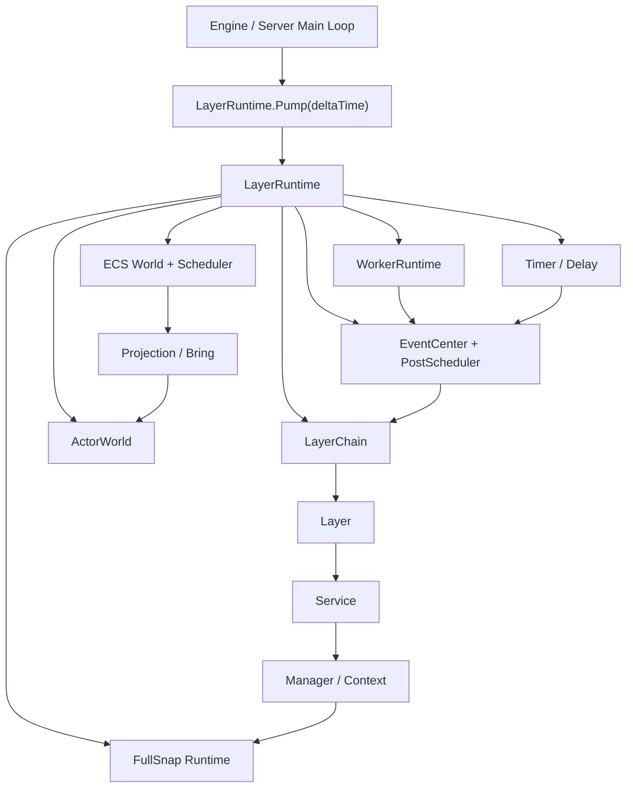

# LayerBase

> LayerBase 是一个面向 Unity、Godot 与纯 C# 服务端的游戏业务运行时分层框架，用 `Layer -> Service -> Manager` 建立业务结构，再从这个结构自然扩展出事件、Call、Timer、Actor、ECS、Worker、Snap 与 LayerTool。

本文档是新版结构化 README 草稿，不覆盖原有 `README.md`。当前功能面以仓库中的 `LayerBase` `1.5.8` 为准。

## What is this?

LayerBase 的核心不是“一个更快的 EventBus”，而是一套游戏业务运行时心智模型：

```text
LayerRuntime
 └── LayerChain
      ├── Layer: 宏观业务边界、执行顺序、系统分区
      │    ├── Service: 一个业务域的能力聚合
      │    │    └── Manager / Context: 具体状态与规则
      │    └── Runtime Capabilities
      │         ├── Event: 层间广播和有序流转
      │         ├── Call: 定向请求响应
      │         ├── Timer / Delay / Post: 帧边界调度
      │         ├── Actor: 独立行为对象
      │         ├── ECS: 数据密集批处理
      │         ├── Worker: 后台纯计算
      │         ├── Snap: 显式业务状态快照
      │         └── LayerTool: 生成式工具对象注册与创建
```

也就是说，LayerBase 先回答“业务应该放在哪里”，再回答“业务之间如何通信、如何调度、如何扩展”。

## Why?

游戏项目变复杂后，痛点通常不是缺某一个工具，而是缺少统一结构：

- 单例和 Manager 互调会让依赖关系变成网。
- 事件到处注册会让执行顺序变成隐式事实。
- 定时器、异步任务、后台线程、Actor、ECS 各自为政，会让主循环越来越难推理。
- 快照和恢复如果没有结构边界，很容易退化成“保存一堆对象”。

LayerBase 的设计选择是：所有能力都挂回 Runtime 和 Layer 结构。Layer 决定宏观顺序，Service 决定业务归属，Manager 决定具体职责，通信和调度能力围绕这个结构展开。

## What It Is Not

- LayerBase is not a game engine.
- LayerBase does not replace Unity, Godot, rendering, physics, networking, or persistence infrastructure.
- LayerBase does not make all APIs thread-safe. Hot-path Runtime APIs are owner-thread only unless explicitly marked as any-thread.
- LayerBase does not save a full memory image. Snap is explicit business-state serialization.
- LayerBase is designed for gameplay/runtime structure, not for hiding architecture decisions.

## Mental Model

### 1. LayerRuntime: one runnable world

`LayerRuntime` 是一个完整运行时实例。它拥有 Layer 链、事件中心、PostScheduler、Timer、Delay、ActorWorld、ECS World、WorkerRuntime、服务容器和 FullSnap Runtime。

它负责：

- 构建拓扑。
- 驱动每帧 `Pump(deltaTime)`。
- 管理同步事件、帧调度事件、定时事件、Actor 邮箱、ECS 提交和后台 Worker 结果。
- 在 Build 后收集可快照对象。

它不负责替代引擎主循环。Unity、Godot 或服务端循环仍然决定什么时候调用 `Pump`。

### 2. Layer: macro boundary, not a folder

Layer 是宏观业务边界，也是执行顺序的基本单位。你可以把它理解成 Runtime 里的“业务车道”：

```text
InputLayer -> BattleLayer -> SimulationLayer -> ViewLayer -> NetworkLayer
```

Layer 负责：

- 表达系统级优先级和顺序。
- 隔离不同业务面。
- 承载本层 Service。
- 作为事件流、Call 路由、生命周期和诊断的边界。

Layer 不负责：

- 承担所有具体业务细节。
- 直接变成巨大 Manager。
- 替代 Actor 或 ECS 处理大量对象。

LayerBase 当前使用位图进行高频路由，单个 Runtime 的物理 Layer 上限是 64。

### 3. Service: business capability inside a Layer

Service 是 Layer 内的业务能力聚合。例如 `PlayerService`、`InventoryService`、`CombatService`、`MatchSyncService`。

Service 负责：

- 注册和持有本业务域的依赖。
- 对外暴露粗粒度能力。
- 挂载 Manager / Context。
- 参与事件订阅、Call、Delay、Snap 等能力。

Service 不应该变成跨全项目的万能入口。如果某个 Service 同时负责输入、战斗、UI、网络同步，通常说明 Layer 或 Service 边界需要拆分。

### 4. Manager / Context: small stateful rule holders

Manager 或 Context 承载更细的业务状态和规则。例如伤害计算、背包格子状态、匹配房间状态、技能冷却表。

它负责：

- 保存明确归属的状态。
- 实现具体规则。
- 通过事件、Call、Service 接口与外部协作。
- 按需实现 `IFullSnap` 或 `IClipSnap<T>`。

它不负责：

- 跨 Layer 编排完整工作流。
- 在后台线程直接操作 Runtime。
- 隐式依赖全局单例。

## Capabilities Grow From Layers

LayerBase 的功能不是平铺的。每个功能都解决 Layer 结构中的一个问题：

| Layer 结构中的问题 | 对应能力 | 说明 |
| --- | --- | --- |
| Layer 之间需要有序广播 | `Send<T>` + `[SubscribeFlow]` | 同步沿 Layer 顺序流转，可通过 `EventHandledState` 继续或截断。 |
| 业务需要延迟到帧边界处理 | `Post<T>` / `TryPost<T>` | 进入 `PostScheduler`，在 `Pump` 中按预算和策略处理。 |
| 后台线程有结果要回主线程 | `PostFromAnyThread<T>` | 只进入跨线程 ingress queue，由 owner thread 在下一帧搬运。 |
| 一个 Layer 需要请求另一个 Layer 的结果 | `CallAsync` / `[Call]` / `ILayerCallHandler` | 定向请求响应，避免把双向依赖写成直接引用。 |
| Service 需要按时间触发业务 | `Timer` / `DelayPublisher` / `this.Delay(...)` | Tick 驱动，和 Runtime Pump 对齐。 |
| Layer 中有大量独立行为对象 | `ActorWorld` / `IActor` | Actor 有邮箱、生命周期、行为处理器、查询和对象池。 |
| Layer 中有大批量纯数据更新 | ECS World / Query / Blueprint | Entity / Component / Query 负责数据密集批处理。 |
| ECS 批处理结果要变成对象行为 | Projection / `Bring<TEvent>()` | Query 生成事件，投递到投影 Actor 或主线程结果流。 |
| 业务有 CPU 密集型纯计算 | `WorkerRuntime` | 后台执行 `IWorkerEventJob<TInput,TEvent>`，结果回到事件流。 |
| Layer / Service / Manager 要保存状态 | `IFullSnap` / `IClipSnap<T>` | 显式写入业务字段，不保存 Runtime 内部队列和线程状态。 |
| UI / 工具 / 视图对象需要按 key 创建 | `LayerToolRegistry` / `[LayerTool]` | 源生成器生成无反射注册代码，支持 Contract + Key 查询、缓存、外部工厂和诊断报告。 |

## Quick Start

安装：

```bash
dotnet add package LayerBase --version 1.5.7
```

源码引用时，核心库、任务库和源生成器应一起接入：

```xml
<ItemGroup>
  <ProjectReference Include="LayerBase\LayerBase.csproj" />
  <ProjectReference Include="LayerBase.Task\LayerBase.Task.csproj" />
  <ProjectReference Include="LayerBase.Generator\LayerBase.Generator\LayerBase.Generator.csproj"
                    OutputItemType="Analyzer"
                    ReferenceOutputAssembly="false" />
</ItemGroup>
```

下面的例子展示 LayerBase 的结构，而不是只展示事件 API：

```csharp
using LayerBase;
using LayerBase.Core.Event;
using LayerBase.DI;
using LayerBase.DI.Options;
using LayerBase.Layers;

public readonly struct DamageCommand
{
    public DamageCommand(int targetId, int amount)
    {
        TargetId = targetId;
        Amount = amount;
    }

    public int TargetId { get; }
    public int Amount { get; }
}

public sealed class DamageManager
{
    public int LastDamage { get; private set; }

    public void Apply(int amount)
    {
        LastDamage = amount;
    }
}

public sealed partial class CombatService : IService
{
    [Mount] private DamageManager _damage = null!;

    public void ConfigureServices(IServiceCollection services)
    {
    }

    public void ApplyDamage(int targetId, int amount)
    {
        // Service 聚合业务能力，Manager 承载具体规则和状态。
        _damage.Apply(amount);
    }
}

public sealed partial class CombatLayer : Layer
{
    [Mount] private CombatService _combat = null!;

    [SubscribeFlow]
    private EventHandledState OnDamage(in DamageCommand command)
    {
        // Layer 接收有序事件，转交给本层 Service。
        _combat.ApplyDamage(command.TargetId, command.Amount);
        return EventHandledState.Continue;
    }
}

LayerRuntime runtime = LayerHub.CreateLayers()
                               .Push(new CombatLayer())
                               .Build();

runtime.Send(new DamageCommand(targetId: 1001, amount: 25));
runtime.Pump(0.016f);
```

这个最小例子的结构是：

```text
LayerRuntime
 └── CombatLayer
      └── CombatService
           └── DamageManager
```

事件只是进入这条结构的方式之一。后续你可以在同一个结构中继续加入 `CallAsync`、`Delay`、`ActorWorld`、ECS Query、Worker Job 和 Snap，而不是把它们散落到项目各处。

## Structured Usage Patterns

### Pattern A: layer-to-layer event flow

当一个事件代表“事实已经发生”，并且多个 Layer 需要按顺序观察它，使用 `Send<T>` 或 `Post<T>`。

```text
InputLayer sends MoveCommand
 -> SimulationLayer updates state
 -> ViewLayer prepares presentation
 -> NetworkLayer emits sync packet
```

同步确定性路径使用 `Send<T>`。需要在帧边界处理、支持预算和背压时使用 `Post<T>`。

### Pattern B: directed request without direct dependency

当一个 Layer 需要另一个 Layer 的返回值，不要直接拿对方对象引用。使用 `CallAsync<TLayer,TRequest,TResponse>`：

```text
UiLayer
 -> CallAsync<InventoryLayer, QueryItemRequest, QueryItemResponse>
 -> InventoryLayer handler
 -> response
```

这保留了 Layer 边界，也避免了双向硬引用。

### Pattern C: time belongs to Runtime

业务中的“稍后执行”“每隔一段时间执行”“下一帧再处理”，应进入 Runtime 的时间系统，而不是散落在线程、Task 或引擎协程中。

```text
Service requests Delay
 -> DelayPublisher stores timer
 -> Runtime.Pump advances time
 -> expired event enters PostScheduler
 -> Layer receives event
```

### Pattern D: Actor is behavior, ECS is data

Actor 和 ECS 不是互相替代：

- ECS 适合大批量数据：位置、速度、状态标记、AOI、碰撞候选。
- Actor 适合独立行为：角色、NPC、子弹、技能实例、对象生命周期。

Projection / Bring 负责把 ECS 批处理结果变成 Actor 可消费的事件：

```text
ECS Query updates data
 -> Bring<MoveViewEvent>()
 -> Runtime drains result
 -> Actor mailbox receives event
 -> Actor behaviour runs during Pump
```

### Pattern E: Worker returns events, not shared state

后台 Worker 适合纯计算。它不应该直接操作 Layer、Actor、ECS World 或引擎对象。

推荐流向：

```text
Service submits IWorkerEventJob
 -> Worker thread computes
 -> returns TEvent
 -> Runtime Pump drains Worker events
 -> normal event subscribers handle result
```

## Architecture



Build 阶段大致完成：

1. 创建 `LayerRuntime`。
2. 推入 Layer 并形成 LayerChain。
3. 挂载 Service / Manager。
4. 通过源生成器和构建流程收集订阅、Call、Actor、Snap、Query 元数据。
5. 初始化 PostScheduler、Timer、Delay、ActorWorld、ECS Scheduler、WorkerRuntime。
6. 冻结策略表并进入可 Pump 状态。

Pump 阶段大致完成：

1. 搬运 `PostFromAnyThread` ingress。
2. 搬运 Worker 结果事件。
3. 推进 Timer / Delay。
4. 处理 PostScheduler 队列。
5. 执行 Layer 生命周期。
6. Flush / Drain ECS 任务结果。
7. Pump Actor 邮箱与生命周期。

## Latest Function Surface

当前 README 覆盖的主要功能面：

最近新增的重点能力是 **LayerTool**：它通过 `[LayerTool]` 标记自定义 Attribute，再由源生成器生成直接注册代码，把按 key 创建的工具对象纳入 `LayerRuntime.Tools`。它支持 `[LayerToolFactory]` 静态工厂、`ILayerToolFactory<T>` 外部工厂、public 无参构造三段创建优先级，并提供 entry 查询、缓存管理、诊断报告和 LBTOOL001-LBTOOL013 编译期诊断。

| Area | Current capabilities |
| --- | --- |
| Runtime | 多 `LayerRuntime`、`LayerHub`、Build、Pump、Prewarm、Reset、Dispose。 |
| DI | `IService`、`IServiceCollection`、`[Mount]`、`[OwnerLayer]`、共享字段绑定。 |
| LayerTool | `[LayerTool]`、`[LayerToolFactory]`、`ILayerToolFactory<T>`、`LayerToolRegistry`、Contract + Key 查询、缓存清理、诊断报告、LBTOOL001-LBTOOL013 analyzer。 |
| Events | `[Subscribe]`、`[SubscribeFlow]`、`[SubscribeNotify]`、事件元数据、事件分类、诊断符号。 |
| Post | Normal、Latest、Coalesced、Dirty、波次隔离、数量预算、时间预算、背压策略。 |
| Threading | owner-thread Runtime API、`PostFromAnyThread` / `TryPostFromAnyThread` any-thread ingress。 |
| Call | `[Call]`、`ILayerCallHandler<TRequest,TResponse>`、`CallAsync`、路由冲突和缺失诊断。 |
| Timer / Delay | `TimeScheduler`、`TimerHandle`、Once、FixedDelay、FixedRate、DelayPublisher。 |
| Actor | ActorId、ActorWorld、Mailbox、ActorBehaviour、Actor Call、生命周期、Query、Pool、EventStream、Delay。 |
| ECS | Entity、Component、Query、Blueprint、Bundle、Projection、Bring、Sync / Async scheduler。 |
| Worker | `WorkerRuntime`、`WorkerHandle`、`WorkerState`、`IWorkerEventJob<TInput,TEvent>`。 |
| Snap | `IFullSnap`、`IClipSnap<T>`、`SnapDocument`、`SnapWriter`、`SnapReader`、数组读写器。 |
| Benchmarks | Event fan-out、Call、ActorWorld、PostScheduler、ECS async boundary benchmarks。 |

## Performance

LayerBase 的性能目标不是一句“高性能”，而是让高频路径在明确约束下低分配、低抖动、可复现。

当前 benchmark 文档位于 `docs/BENCHMARKS.md`。其中明确把 ECS Async benchmark 拆成 SubmitOnly、WarmWorker EndToEnd、ColdWorkerWakeLatency、FrameBatch 和 Bring 等场景，不把它们合并成一个模糊数字。

已记录的代表性结果包括：

| Scenario | Condition | Result |
| --- | --- | --- |
| Notify fan-out | 1M Notify calls，1/4/8/16 subscribers | LayerBase 约 1.6582 ns 到 6.1484 ns / Notify。 |
| Multi-event batch | 32/128/256 event kinds，2 或 3 subscribers | 在记录表中相对 MessagePipe 有约 12.8% 到 41.4% 优势。 |
| Request / Response | 100k `LayerBase CallAsync` calls | 总耗时约 108.15 us，约 1.08 ns / Call，0 B 分配。 |
| ECS Async | controlled warm-worker scenarios | 证明核心异步查询链在受控场景中低分配、低延迟；不等价于完整游戏帧稳定性。 |

运行测试：

```bash
dotnet test LayerBase.Test/LayerBase.Test.csproj -c Debug
```

运行 benchmark：

```bash
dotnet run --project LayerBase.BenchMark/LayerBase.BenchMark.csproj -c Release -- --filter *
```

## Project Status

当前建议状态：**Alpha / Active Development**。

依据：

- 核心运行时、事件、DI、Call、Timer、Delay、Actor、ECS、Snap、Worker 已有较多 NUnit 测试和 benchmark 项目。
- 版本号为 `1.5.7`，具备 NuGet 打包配置。
- 代码中仍保留大量架构计划、性能优化计划和实验性能力，API 与文档边界还在快速整理。
- 部分历史文档和示例注释存在编码问题，需要继续清理。

生产项目可以评估接入，但建议固定版本、在项目内部封装适配层，并为关键路径建立自己的回归测试和 benchmark。

## Documentation

| Document | Purpose |
| --- | --- |
| `README.md` | 现有完整 README，包含大量中英文说明和历史细节。 |
| `README.generated.md` | 本文件，结构化 README 草稿，不覆盖原 README。 |
| `docs/layer-tool.md` | LayerTool 生成式对象注册、外部工厂、Registry 诊断 API 与 analyzer 诊断表。 |
| `docs/BENCHMARKS.md` | benchmark 数据与解释边界。 |
| `docs/THREADING.md` | Runtime 线程模型、owner-thread API 与 any-thread API。 |
| `docs/wiki/Event-System.md` | 事件系统补充文档。 |
| `docs/api/simple/context-first.md` | Context-first API 文档。 |
| `LayerBase.Usage/` | 可运行示例。 |
| `LayerBase.Test/` | NUnit 行为测试和回归测试。 |
| `LayerBase.BenchMark/` | BenchmarkDotNet 性能测试。 |

建议后续把文档拆成：

```text
docs
 ├── architecture.md
 ├── mental-model.md
 ├── quick-start.md
 ├── event-and-call.md
 ├── actor-and-ecs.md
 ├── threading.md
 ├── snapshot.md
 ├── benchmark.md
 └── roadmap.md
```

## Roadmap

短期：

- 把原 README 拆成入口文档、心智模型、API 手册、benchmark 和设计文档。
- 修复示例与部分文档中的中文编码问题。
- 标注 `1.5.x` 中稳定 API 与 experimental API。
- 补充 Unity / Godot 主循环集成示例。
- 给 WorkerRuntime、Async ECS、Actor Projection、Snap 各补一篇独立文档。

中期：

- 稳定 Async ECS 的 warm worker、cold wake、frame batch、Bring 结果回流模型。
- 完善 Actor 生命周期预算化 Tick、Actor Query、Actor Call 和对象池文档。
- 明确 Arch 依赖与自研 ECS 内核之间的长期边界。
- 建立可复现、版本化的 benchmark 结果目录。

## License

LayerBase 使用 Apache-2.0 License。详见 `LICENSE.txt`。
